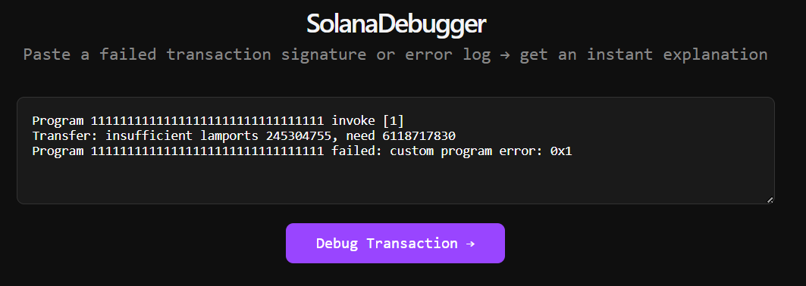
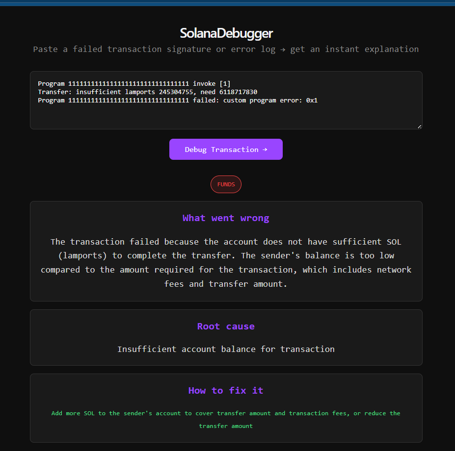

# SolanaDebugger

AI-powered Solana transaction debugger. Paste any failed transaction signature or error log and get an instant plain-English explanation + fix.

## What it does

Solana developers waste hours decoding cryptic transaction errors like:

Program 11111111111111111111111111111111 failed: custom program error: 0x1

SolanaDebugger explains what went wrong, the root cause, and exactly how to fix it in seconds.

## Demo

### Input



### Result



## Video

https://github.com/user-attachments/assets/271ba5bc-397a-4b52-ab99-d260eb67a321

## Tech Stack

- **Frontend:** React + Vite
- **Backend:** Python + FastAPI
- **AI:** Claude (via OpenRouter)
- **Blockchain data:** Helius RPC

## How it works

1. User pastes a failed transaction signature or raw error logs
2. Backend fetches full transaction data from Solana via Helius RPC
3. Claude AI analyzes the logs and error codes
4. Returns plain English explanation, root cause, severity, and fix

## Setup

### Backend

```bash
cd backend
python -m venv venv
venv\Scripts\activate
pip install fastapi uvicorn anthropic httpx python-dotenv
```

Create `.env` file:

OPENROUTER_API_KEY=your_key
HELIUS_API_KEY=your_key

Run:

```bash
uvicorn main:app --reload
```

### Frontend

```bash
cd frontend
npm install
npm run dev
```

## Error types supported

- **Funds** — insufficient SOL or token balance
- **Config** — wrong accounts or parameters
- **Bug** — program logic errors
- **CPI** — cross-program invocation failures

## Built for

Colosseum Frontier Hackathon — May 2026
